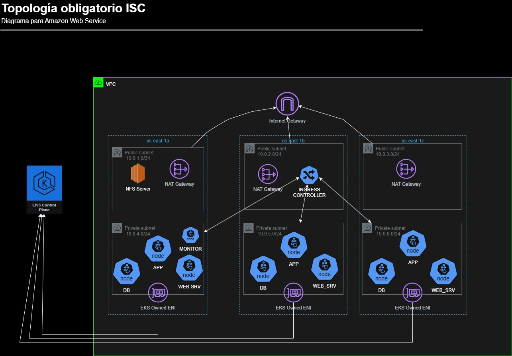

# Obligatorio-ISC

--- 
## OBJETIVOS Y FUNCIONAMIENTO DE LA APLICACIÓN
La aplicación se trata de una plataforma de clases online que permite dividir las clases por materia.
Para eso contamos con un directorio en el *NFS Server* donde se subiran los videos. Este mismo path esta siendo monitorizado por un script, el cual genera una entrada en la base de datos cuando detecta una clase nueva.

---
## REQUISITOS:
 1) DOCKER corriendo en la máquina local
 2) Terraform 

## DESPLIEGUE DEL PROYECTO
Se cuentan con los manifiestos en la carpeta */manifests/deployments*:
- **django-web.yml** es el encargado de desplegar la aplicación.
- **efs-monitor-pod.yml** monitorea un directorio y en caso de haber un video nuevo envía una entrada a la base de datos.
- **postgres.yml** despliega la base de datos.
- **web-server** utiliza nginx para brindar los contenidos estáticos de la aplicación.
Todas las imágenes de estos manifiestos exepto la de postgres, estan subidas a un ecr y sos obtenidas con su url para ser utilizadas por los deployments.

## KUBERNETES
Contamos con 4 tipos de conteiners (uno por pod) que utilizan los manifiestos anteriores.
Infraestructura dentro de k8s:
- STORAGE: creamos un Persistant Volume y PVC para cada pod. Por lo tanto los PV están bindeados a un directorio dentro de el NFS-SERVER. Intentamos realizarlo con Storage Class mediante drivers automáticos de NFS, EFS y S3 (csi drivers) pero no logramos hacerlos funcionar con la cuenta Academy.
- NFS SERVER: Desplegamos el servidor con el fin de alojar los archivos estáticos (css y js) de la app y los videos de clases.
- SERVICES: También disponibilizamos services de tipo Cluster IP con el fin de ser utilizados por el INGRESS, según la ruta del proyecto que se desee acceder, el INGRESS ruteara a los clientes.

## TERRAFORM
En la subcarpeta de Terraform tenemos los siguiente archivos:
- **eks.tf** en este archivo desplegamos el core de la infraestructura, logrando dejar operativo el Cluster, los nodos, deployments, las imagenes de los containers publicadas en ECR y los manifiestos de todos los objetos requeridos de ***Kubernetes***
- **network.tf** utilizamos un módulo que configura la VPC y todo lo relacionado a networking
- **provider** se utiliza con fines de autenticación hacia ECR para subir las imágenes y para el provider de kubectl, logrando que interactue con EKS
- **terraform** declara las apis a utilizar por los providers y sus respectivas versiones
- **storage** encargado de desplegar el server nfs, los pvc, storage class y el security group para el server